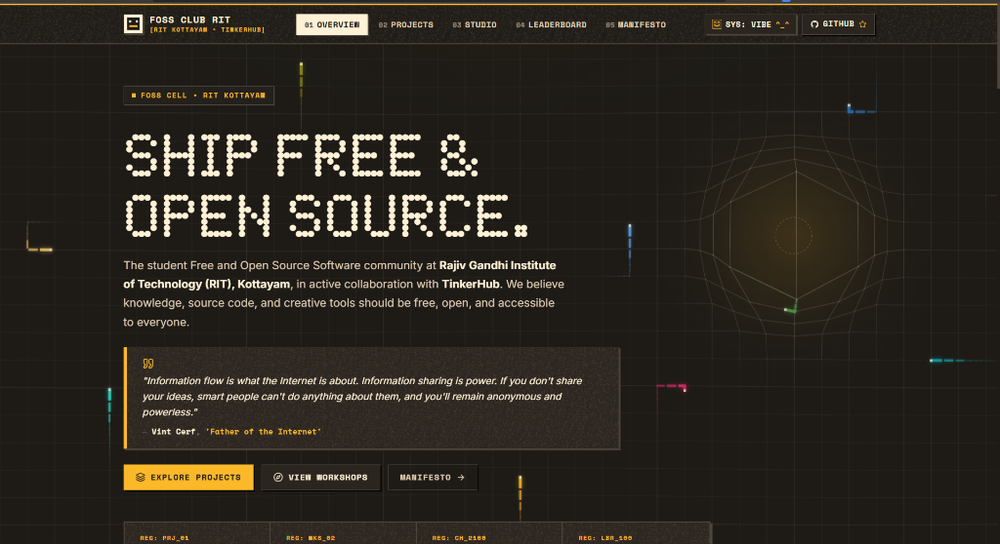
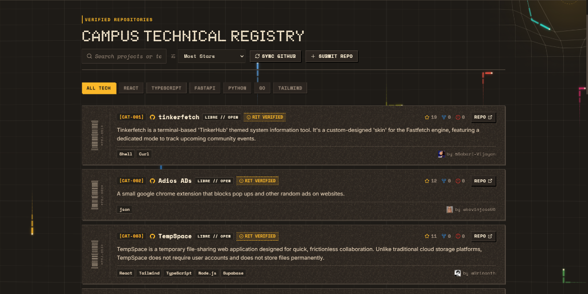
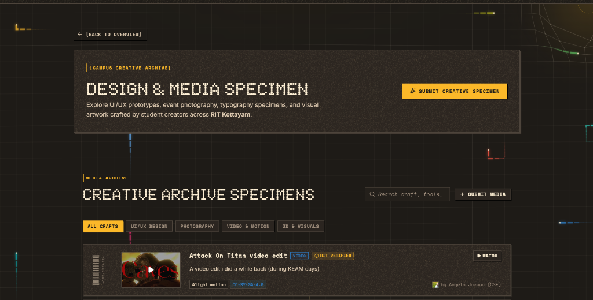
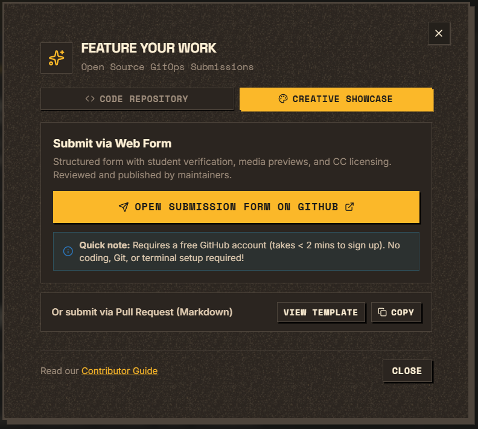
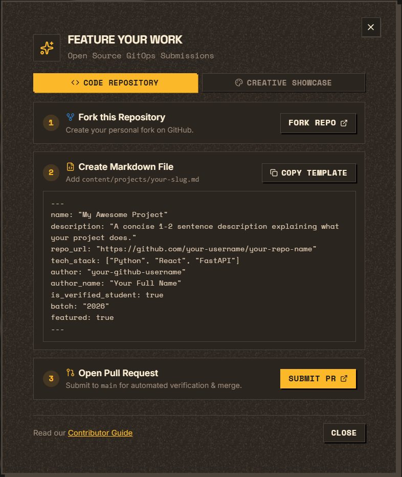
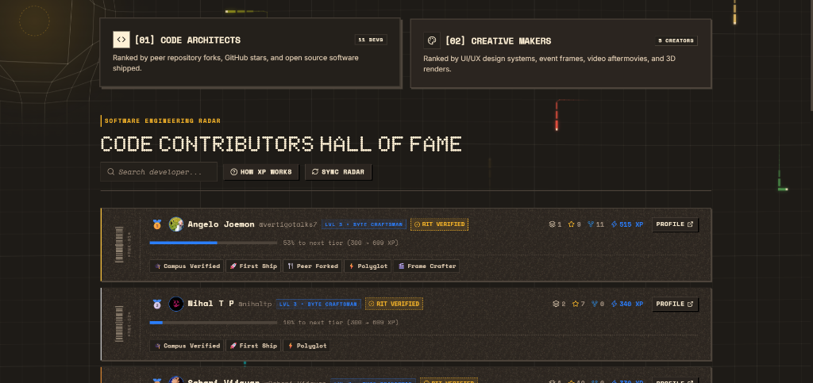
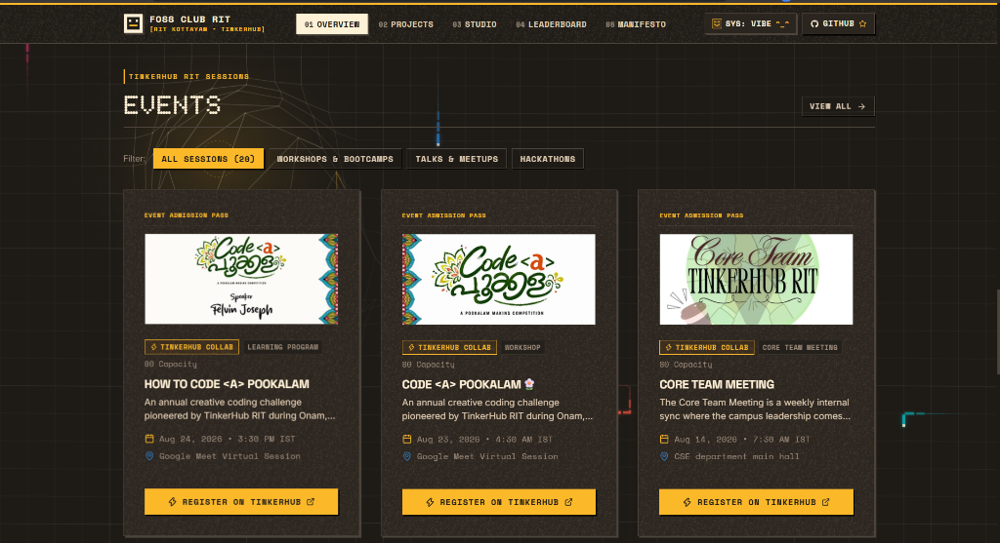

# FOSS Club — RIT Kottayam

> [**Overview**](README.md) • [**Contributing Guide**](CONTRIBUTING.md) • [**Maintainer Handbook**](MAINTAINER_GUIDE.md) • [**Future Scaling Blueprint**](FUTURE_PLAN.md) • [**License**](LICENSE)

The official community platform for the Free and Open Source Software (FOSS) Club at Rajiv Gandhi Institute of Technology (RIT), Government Engineering College, Kottayam, in collaboration with the [TinkerHub Foundation](https://tinkerhub.org) (Campus Chapter 2160).

**Motto:** *Learn. Share. Contribute.*

<p align="center">
  
</p>

---

## What Can You Feature on the Platform?

We showcase student makers and creative creators across campus:

### 1. 💻 Code Repositories (`content/projects/`)
Web apps, AI/ML models, mobile apps, hardware firmware, CLI tools, and automation scripts. Each repository card highlights tech tags, real-time GitHub stars & forks, verified student stamps, and retro ticket barcodes.

<p align="center">
  
</p>

### 2. 🎨 Creative Showcases (`content/creatives/`)
UI/UX design systems (Penpot/Figma), event photography series, video aftermovies/teasers (DaVinci Resolve/Kdenlive), typography specimens, and 3D artwork (Blender).

<p align="center">
  
</p>

---

## How to Feature Your Work

### 🎨 Method 1: Web Form (Fastest for Designers, Photographers & Video Creators)
No local terminal setup or Git commands required:
1. Open the [**Creative Showcase Submission Form**](https://github.com/vertigotalks7/FOSS-RIT/issues/new?template=creative-submission.yml) on GitHub or click **Feature Your Work** in the navigation header.
2. Fill out your details (Title, Craft Category, Tools Used, Media URL, and KTU Roll No for verified status).
3. Click **Submit new issue**.
4. Once a club maintainer reviews and labels it `approved`, the automated bot commits your work and deploys it live in ~10 seconds!

*(Requires a free GitHub account — takes < 2 minutes to create).*

<p align="center">
  
</p>

---

### 💻 Method 2: Git Pull Request (For Developers & Code Projects)

Follow the guided 3-step GitOps workflow directly in the web app or through standard Git commands:

<p align="center">
  
</p>

#### Step 1: Fork This Repository
Click the **Fork** button at the top right of this repository to create your copy on GitHub.

#### Step 2: Add Your Markdown File
- **For Software / Code Projects:** Create `content/projects/<project-name>.md`
- **For Creative Showcase via PR:** Create `content/creatives/<work-name>.md`

##### Template: Code Project (`content/projects/smart-parking.md`)
```markdown
---
name: "Smart Campus Parking Radar"
description: "IoT sensor and computer vision system tracking real-time parking space occupancy at RIT."
repo_url: "https://github.com/your-username/smart-parking"
tech_stack: ["Python", "OpenCV", "React"]
author: "your-github-username"
author_name: "Your Full Name"
is_verified_student: true
batch: "2026"
featured: true
---

### About the Project
Summary of what the project does, key features, and how to run it.
```

##### Template: Creative Showcase (`content/creatives/campus-transit-ui.md`)
```markdown
---
title: "Campus Transit App Design System"
category: "design" # Options: design | photography | video | 3d
author: "your-github-or-handle"
author_name: "Your Full Name"
batch: "2026"
department: "CSE"
tools: ["Penpot", "Inkscape"]
media_url: "https://design.penpot.app/#/view/..."
thumbnail_url: "https://images.unsplash.com/photo-1581291518857-4e27b48ff24e?w=800"
aspect_ratio: "16:9" # Options: 16:9 | 3:2 | 1:1
license: "CC-BY-SA-4.0" # Creative Commons: CC-BY-4.0, CC-BY-SA-4.0, CC0-1.0
is_verified_student: true
featured: true
---

A modern, open design system for campus navigation and transit schedules.
```

#### Step 3: Submit a Pull Request
1. Commit the file and open a **Pull Request** to `main`.
2. Automated GitHub Actions will validate your frontmatter, verify links, and block raw binary files to keep repository storage light.
3. Once merged, your work automatically displays on the live website!

---

## Contributor Leaderboard & RPG XP System

A transparent, XP-driven progression engine celebrating both software builders and creative artists. Contributor ranks are calculated directly from authentic project releases, peer engagement, and open-source tool adoption.

<p align="center">
  
</p>

| Milestone / Metric | XP Award | Criteria |
| :--- | :--- | :--- |
| **Campus Verified** | `+50 XP` | Verified RIT student maker (via KTU ID) |
| **First Submission** | `+100 XP` | First project or creative showcase featured |
| **Progressive Works** | `+60 / +40 / +25 XP` | 2nd (+60), 3rd (+40), and 4th+ (+25 each) works |
| **GitHub Stars** | `+10 XP` per star | Capped at 150 XP per project to prevent gaming |
| **Peer Forks** | `+20 XP` per fork | Capped at 100 XP per project |
| **Tool / Tech Versatility** | `+15 XP` per tech | Bonus for exploring diverse stacks & creative tools (max 60 XP) |
| **Open Tool Bonus** | `+40 XP` | Work made with FOSS tools (*Penpot, Blender, Krita, Kdenlive*) |

### Contributor Levels:
- **Level 1 (0 – 99 XP):** *Script Tinkerer*
- **Level 2 (100 – 299 XP):** *Open Source Novice*
- **Level 3 (300 – 699 XP):** *Byte Craftsman*
- **Level 4 (700 – 1499 XP):** *Systems Architect*
- **Level 5 (1500+ XP):** *Kernel Overlord*

---

## Campus Workshops & Events Radar

In collaboration with [TinkerHub RIT](https://tinkerhub.org), all upcoming hackathons, hands-on bootcamps, and community meetups are automatically scraped and displayed live with direct registration passes:

<p align="center">
  
</p>

---

## Documentation & Maintainer Guides

- [**Contributor Guide**](CONTRIBUTING.md): Detailed step-by-step submission rules.
- [**Maintainer Triage Guide**](MAINTAINER_GUIDE.md): Review checklist for club maintainers.
- [**Future Architecture Blueprint**](FUTURE_PLAN.md): Technical roadmap and scaling patterns.

---

## License

This project is open-source under the [MIT License](https://opensource.org/licenses/MIT).

- **Institution:** [Rajiv Gandhi Institute of Technology (RIT), Kottayam](https://rit.ac.in)
- **Partner Community:** [TinkerHub Foundation](https://tinkerhub.org)
- **Created & Maintained by:** [@vertigotalks7](https://github.com/vertigotalks7)
